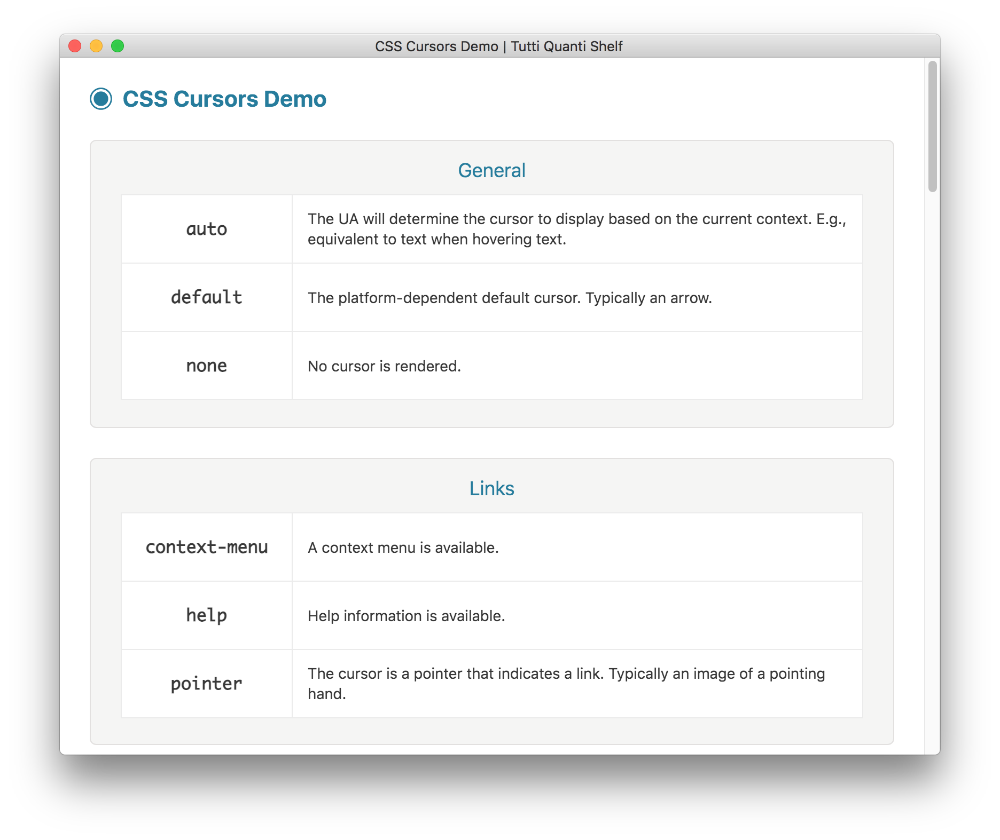
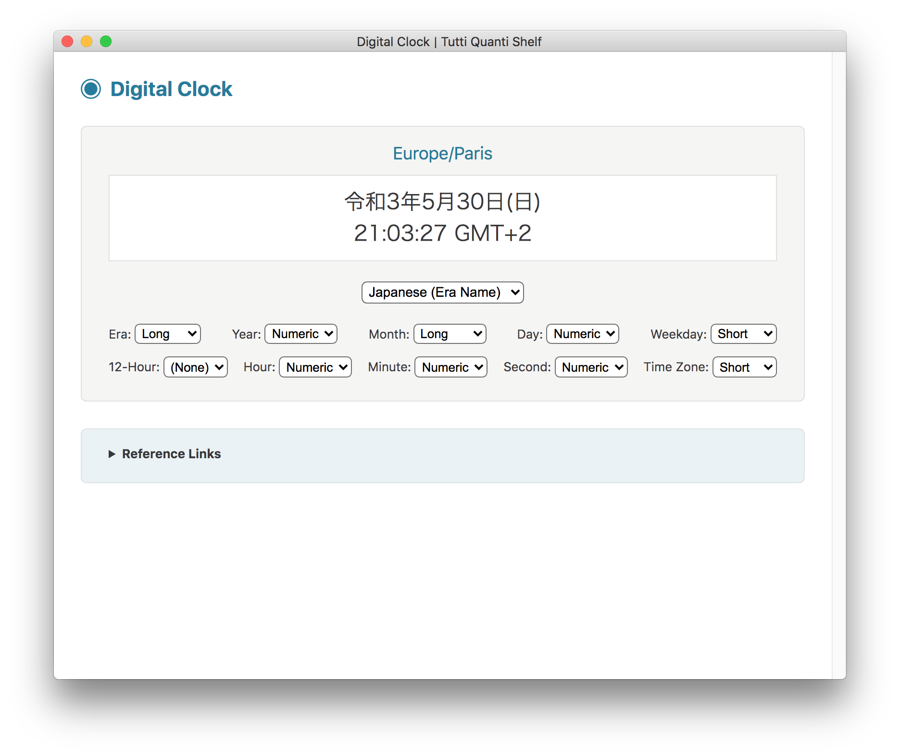
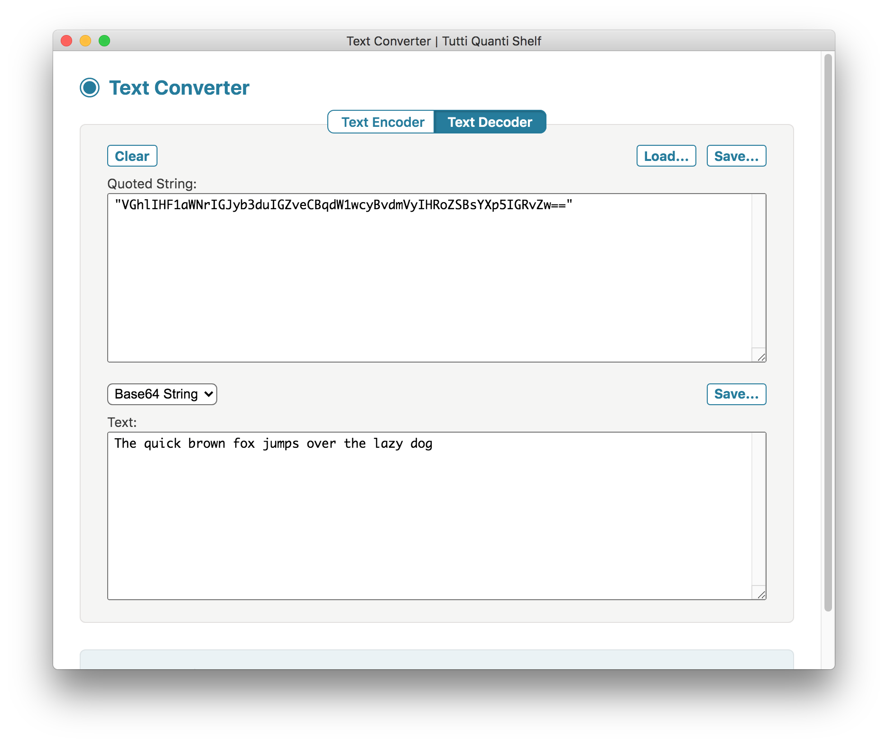

#  TUTTI QUANTI SHELF

**Tutti Quanti Shelf** is a collection of miscellaneous developer-oriented utilities wrapped into one single app, built with [Electron](https://electronjs.org).

This app works on macOS, Linux and Windows operating systems.

## Utilities

The following utilities are currently available:

- **CIDR Calculator**
- **CSS Cursors Demo**
- **Digital Clock**
- **IETF Language Tags**
- **JavaScript Parser**
- **JavaScript Runner**
- **JSON Formatter**
- **LaTeX Math Renderer**
- **Roman Numerals**
- **System Information**
- **Text Converter**
- **XML Converter**

## CIDR Calculator

Simple CIDR calculators:

* CIDR to IP Range
* IP Range to CIDR List


## CSS Cursors Demo

Display CSS cursors by category:



## Digital Clock

Customizable clock, using language-sensitive text formatting for date and time:



## IETF Language Tags

References for IETF BCP 47 language tags and subtags:


## JavaScript Parser

JavaScript code parser and tokenizer, based on Esprima:


## JavaScript Runner

JavaScript code runner, useful for quick testing/prototyping or data processing:


## JSON Formatter

JSON data formatter and validator:


## LaTeX Math Renderer

LaTeX math expression renderer, using the KaTeX JavaScript library:


## Roman Numerals

Converters between roman and arabic numerals:

* Roman to Arabic Numeral
* Arabic to Roman Numeral


## System Information

Detailed list of system information, by category:

* Framework
* Main Process
* Renderer Process
* Application
* Navigator
* Operating System
* OS User Info
* Screen
* Window
* Environment


## Text Converter

Encode and decode text according to several string formats:

* JSON String
* Hex String
* Base64 String




## XML Converter

Convert XML to JSON:


## Building

You'll need [Node.js](https://nodejs.org) installed on your computer in order to build this app.

```bash
git clone https://github.com/tonton-pixel/tutti-quanti-shelf
cd tutti-quanti-shelf
npm install
npm start
```

If you don't wish to clone, you can [download the source code](https://github.com/tonton-pixel/tutti-quanti-shelf/archive/master.zip).

Several scripts are also defined in the `package.json` file to build OS-specific bundles of the app, using the simple yet powerful [Electron Packager](https://github.com/electron-userland/electron-packager) Node module.\
For instance, running the following command will create a `Tutti Quanti Shelf.app` version for macOS:

```bash
npm run build-darwin
```

## Using

You can [download the latest release](https://github.com/tonton-pixel/tutti-quanti-shelf/releases) for macOS.

## License

The MIT License (MIT).

Copyright © 2019 Michel MARIANI.
