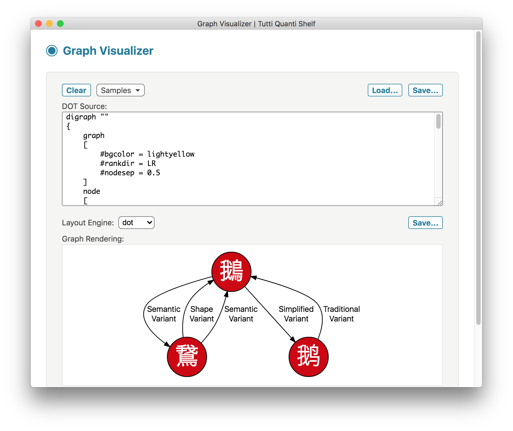
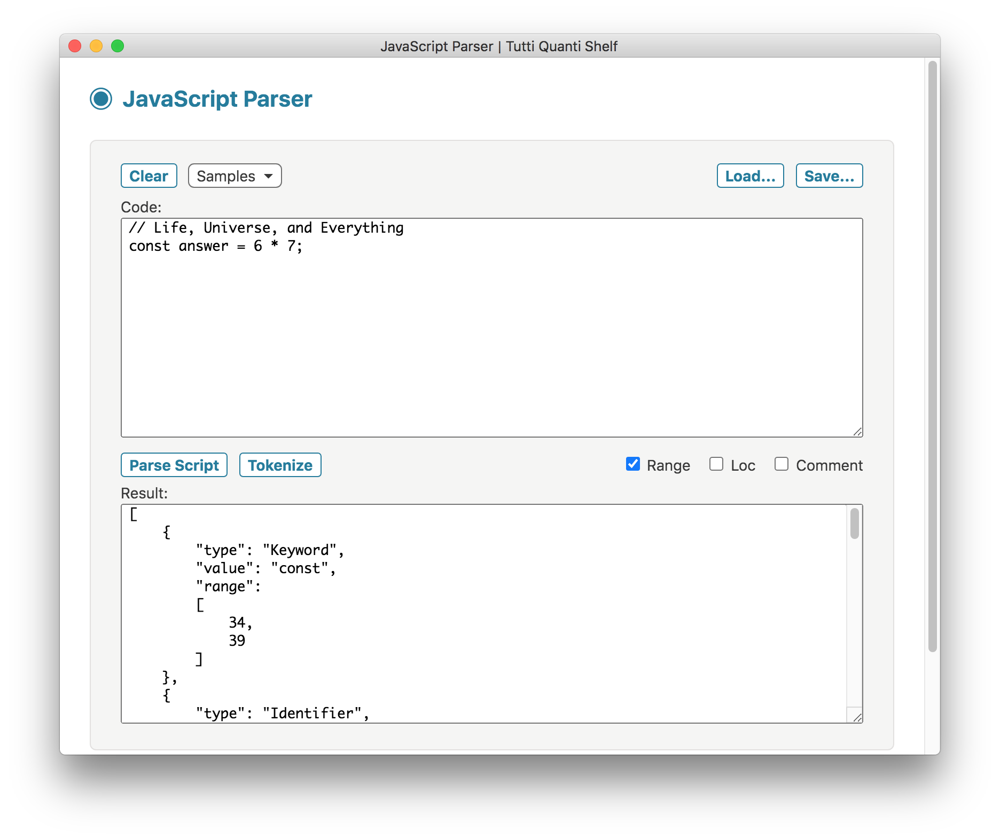
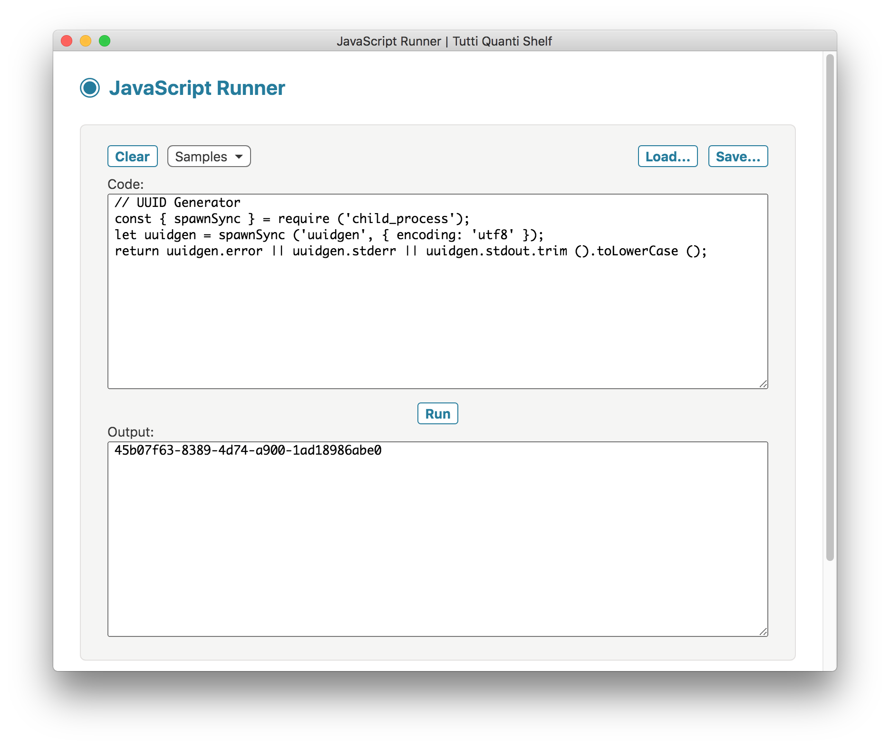
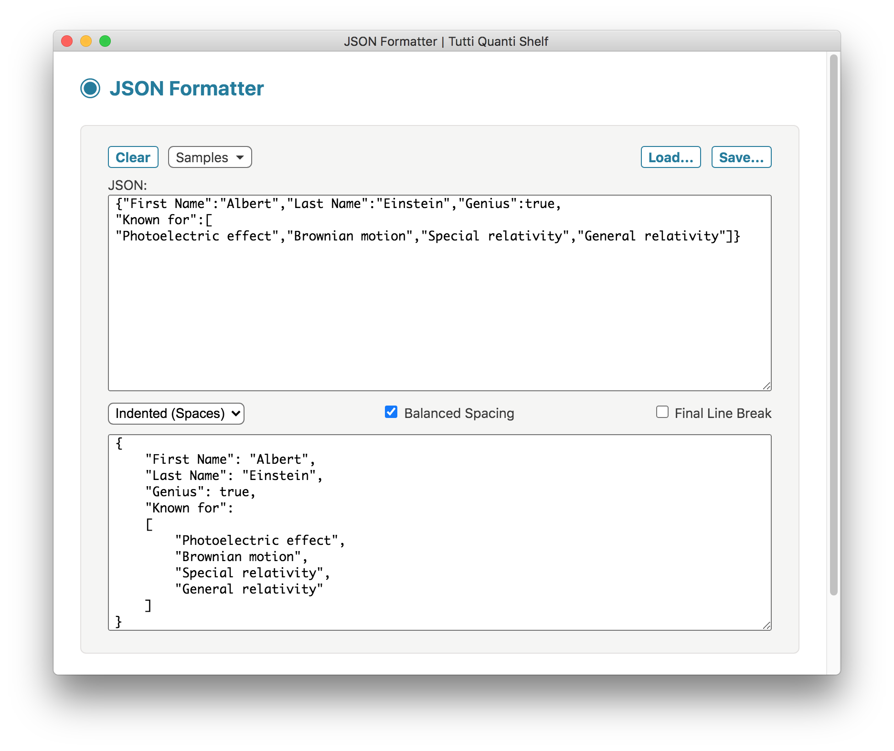
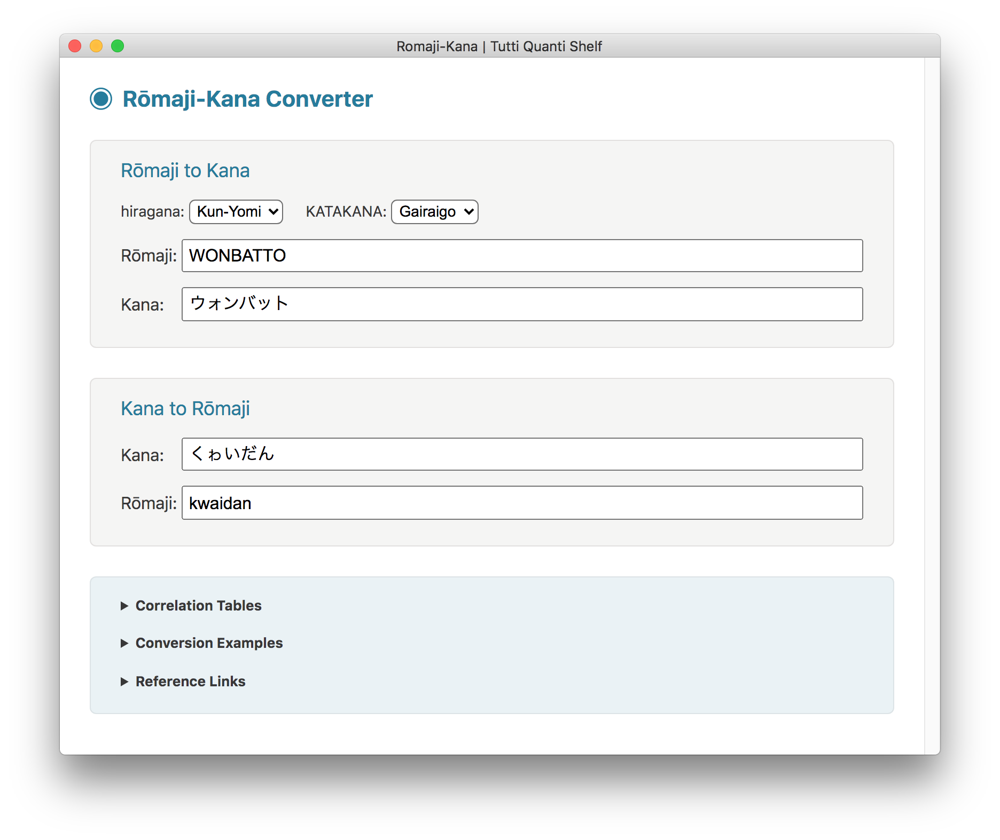
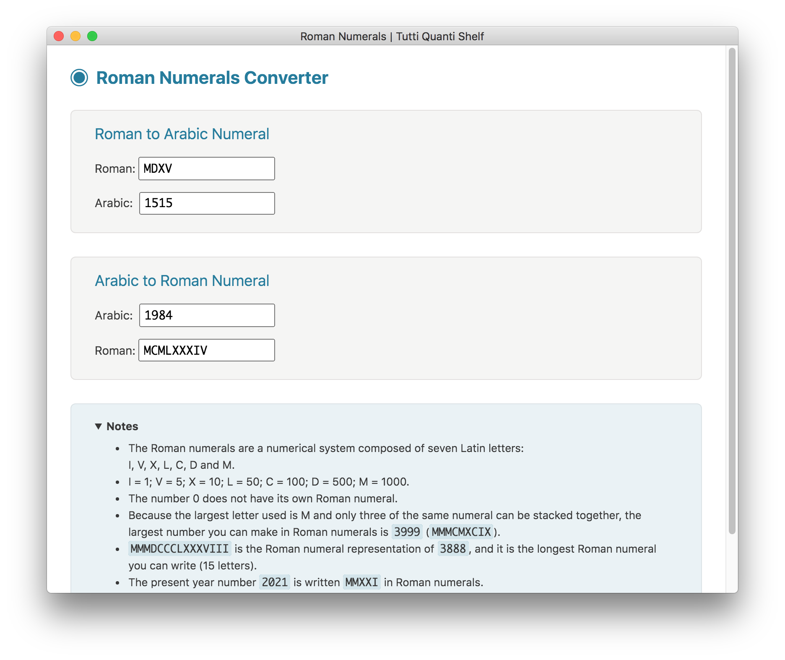
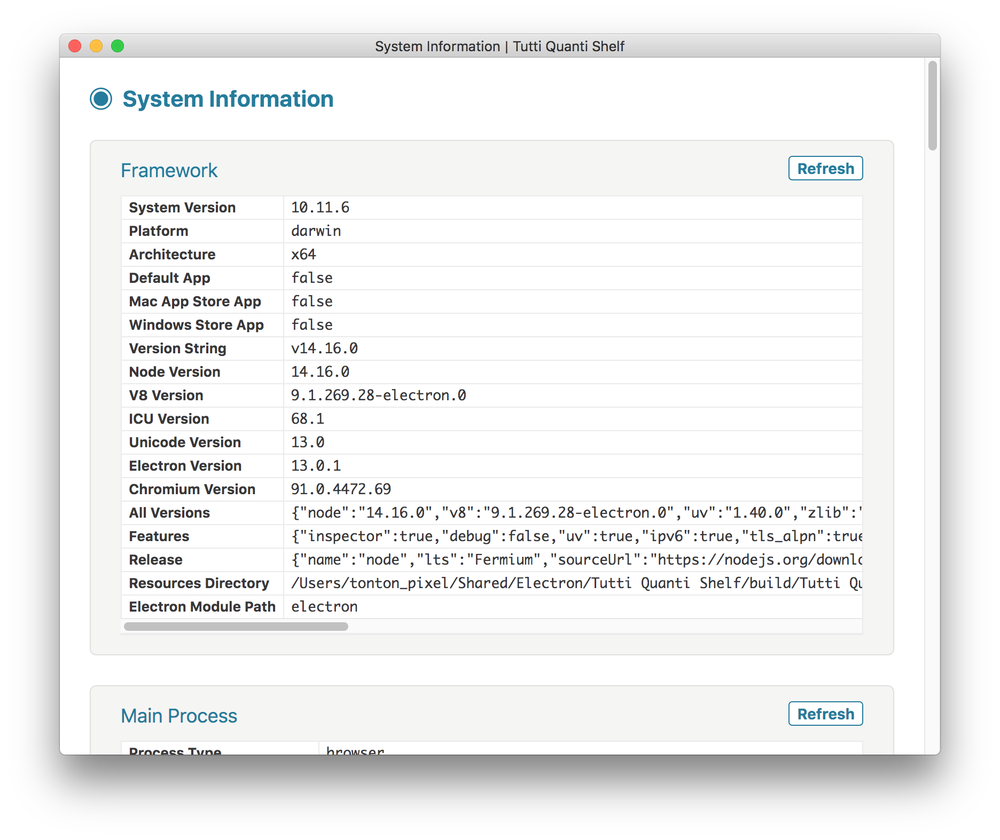
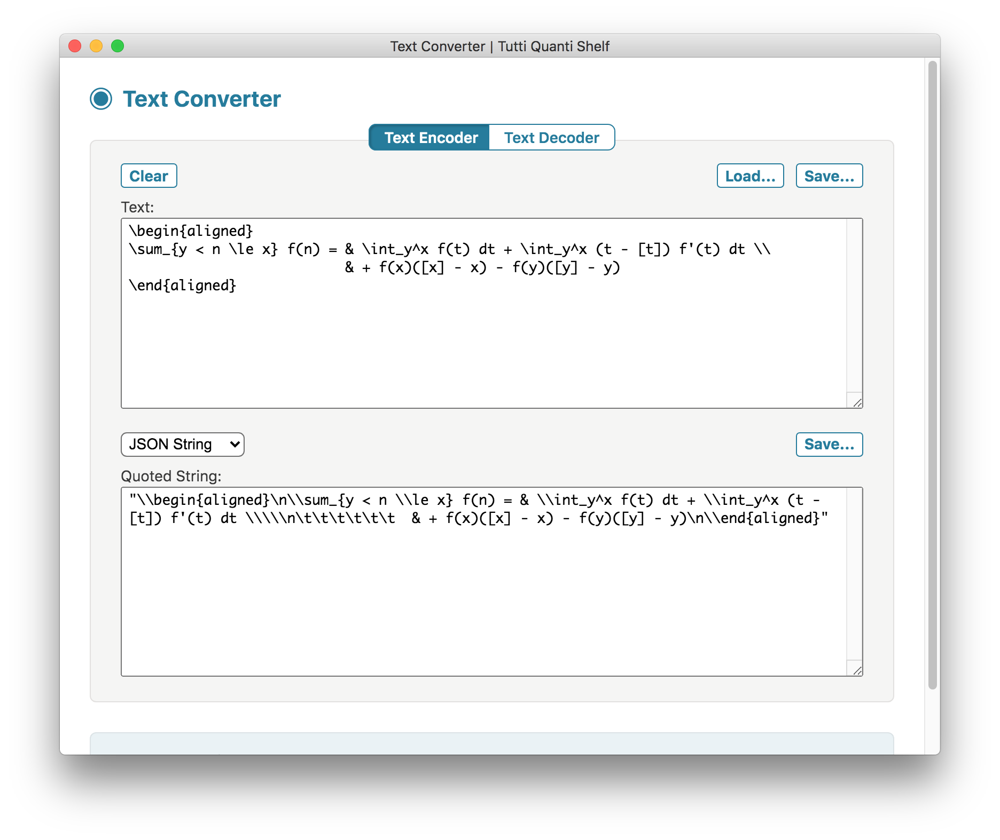
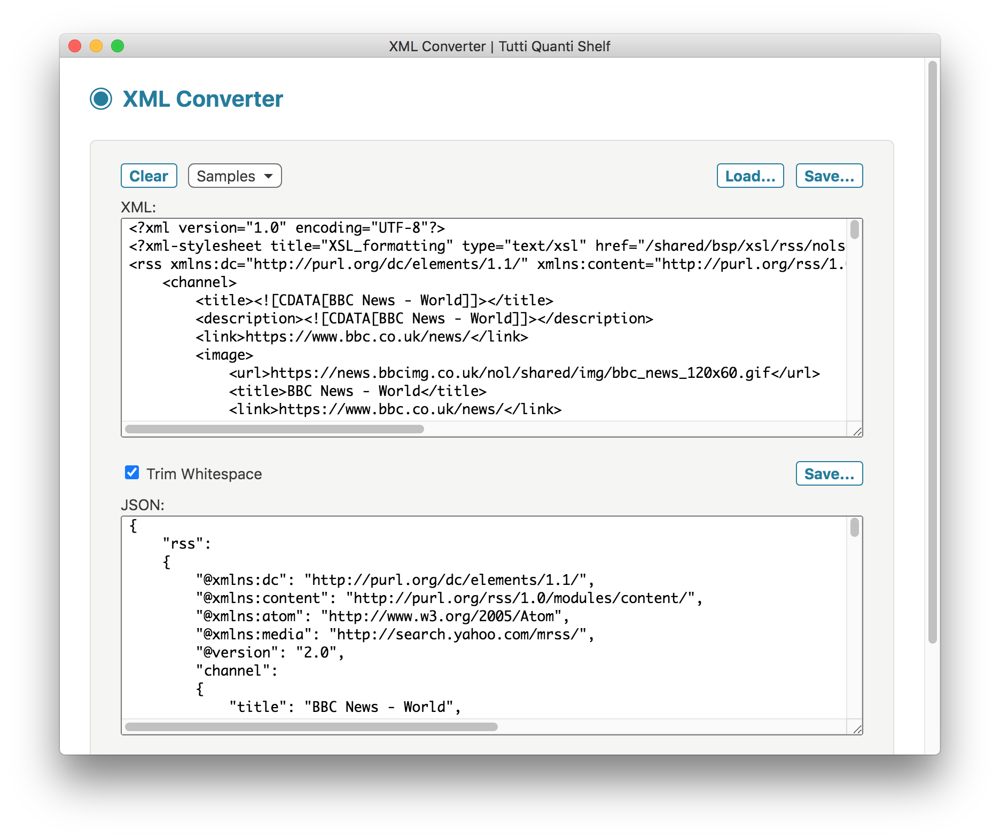

#  TUTTI QUANTI SHELF

**Tutti Quanti Shelf** is a collection of miscellaneous developer-oriented utilities wrapped into one single app, built with [Electron](https://www.electronjs.org/).

This desktop application works on macOS, Linux and Windows operating systems.

## Utilities

The following utilities are currently available:

- **CIDR Calculator**
- **CSS Cursors Demo**
- **Digital Clock**
- **Graph Visualizer**
- **IETF Language Tags**
- **JavaScript Parser**
- **JavaScript Runner**
- **JSON Formatter**
- **LaTeX Math Renderer**
- **Romaji-Kana**
- **Roman Numerals**
- **System Information**
- **Text Converter**
- **XML Converter**

## CIDR Calculator

Simple CIDR calculators:

* CIDR to IP Range
* IP Range to CIDR List


## CSS Cursors Demo

Display CSS cursors by category:


## Digital Clock

Customizable clock, using language-sensitive text formatting for date and time:


## Graph Visualizer

Graph visualizer, using the Graphviz visualization software:



## IETF Language Tags

References for IETF BCP 47 language tags and subtags:


## JavaScript Parser

JavaScript code parser and tokenizer, based on Esprima:



## JavaScript Runner

JavaScript code runner, useful for quick testing/prototyping or data processing:



## JSON Formatter

JSON data formatter and validator:



## LaTeX Math Renderer

LaTeX math expression renderer, using the KaTeX JavaScript library:


## Romaji-Kana

Simple converters between rōmaji and kana:

* Rōmaji to Kana
* Kana to Rōmaji



## Roman Numerals

Converters between roman and arabic numerals:

* Roman to Arabic Numeral
* Arabic to Roman Numeral



## System Information

Detailed list of system information, by category:

* Framework
* Main Process
* Renderer Process
* Application
* Navigator
* Operating System
* OS User Info
* Screen
* Window
* Environment



## Text Converter

Encode and decode text according to several string formats:

* JSON String
* Hex String
* Base64 String




## XML Converter

Convert XML to JSON:



## Using

You can [download the latest release](https://github.com/tonton-pixel/tutti-quanti-shelf/releases) for macOS.

## Building

You'll need [Node.js](https://nodejs.org/) (which comes with [npm](https://www.npmjs.com/)) installed on your computer in order to build this application.

### Clone method

```bash
# Clone the repository
git clone https://github.com/tonton-pixel/tutti-quanti-shelf
# Go into the repository
cd tutti-quanti-shelf
# Install dependencies
npm install
# Run the application
npm start
```

**Note**: to use the clone method, the core tool [git](https://www.git-scm.com/) must also be installed.

### Download method

If you don't wish to clone, you can [download the source code](https://github.com/tonton-pixel/tutti-quanti-shelf/archive/master.zip), unZip it, then directly run the following commands from a Terminal opened at the resulting `tutti-quanti-shelf-master` folder location:

```bash
# Install dependencies
npm install
# Run the application
npm start
```

### Packaging

Several scripts are also defined in the `package.json` file to build OS-specific bundles of the application, using the simple yet powerful [Electron Packager](https://github.com/electron-userland/electron-packager) Node module.\
For instance, running the following command (once the dependencies are installed) will create a `Tutti Quanti Shelf.app` version for macOS:

```bash
# Build macOS (Darwin) application
npm run build-darwin
```

## License

The MIT License (MIT).

Copyright © 2019-2020 Michel MARIANI.
